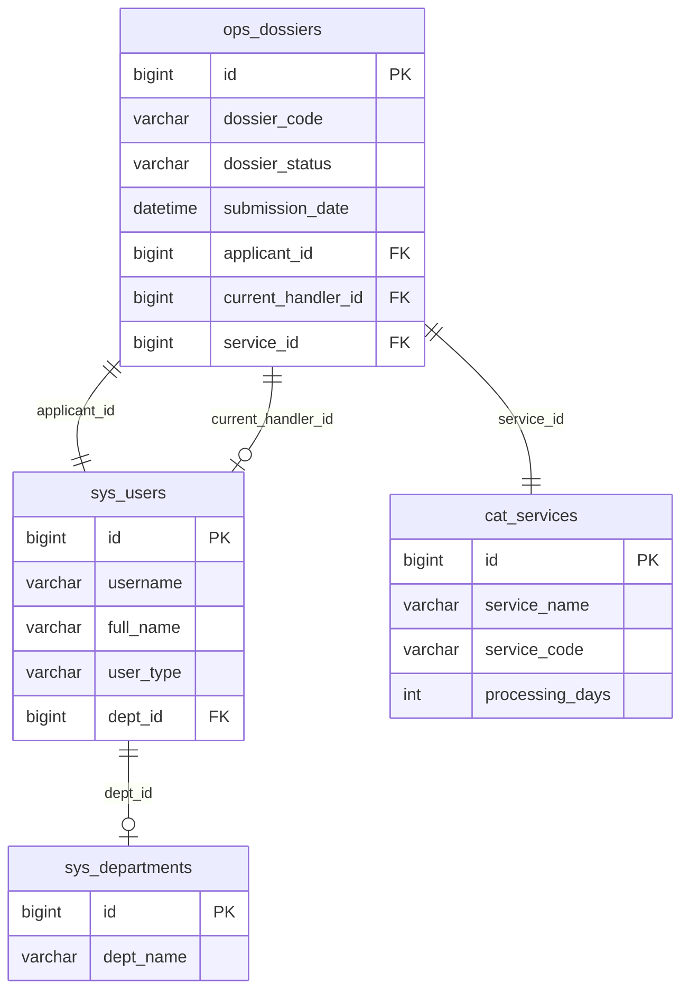
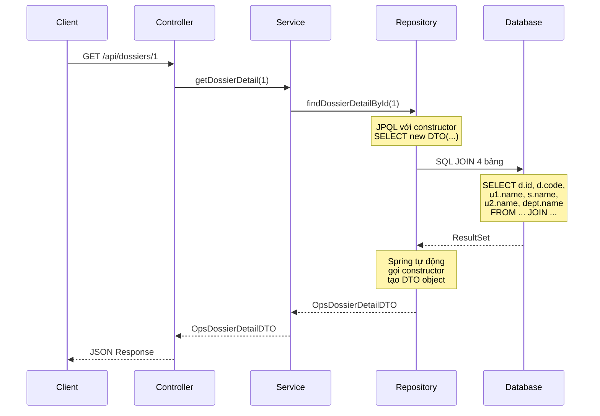
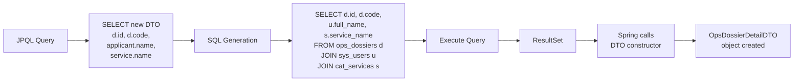
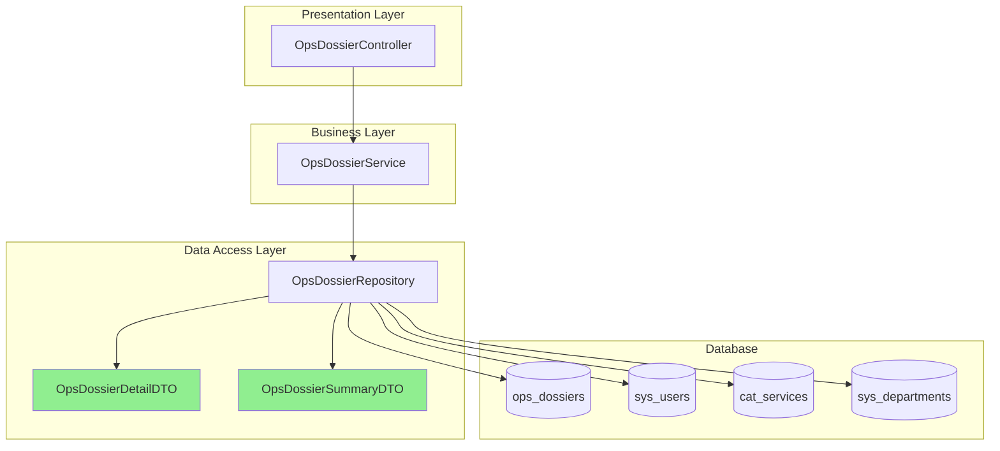
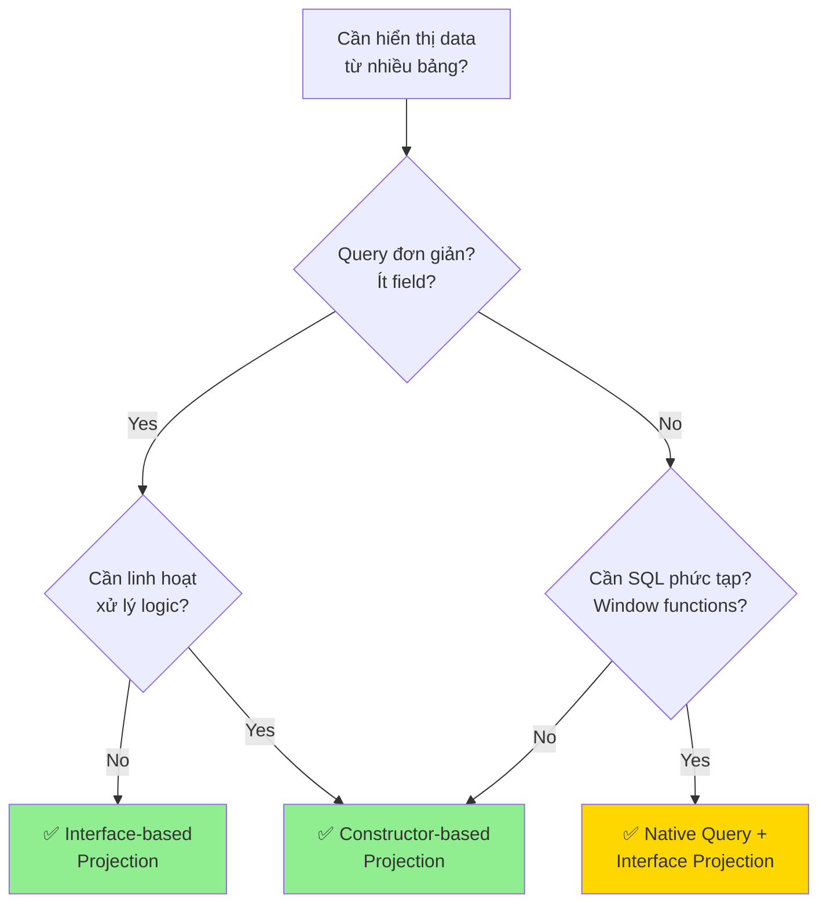
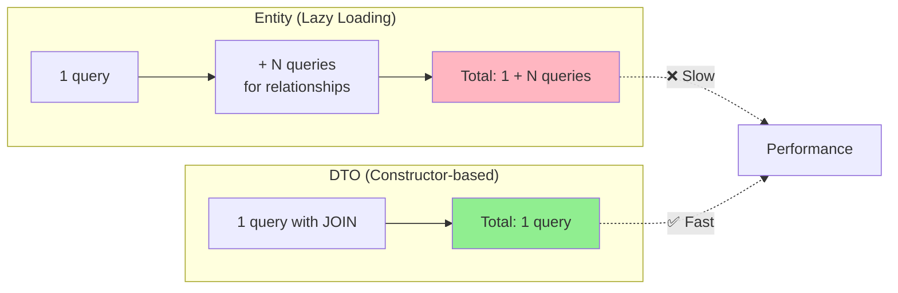
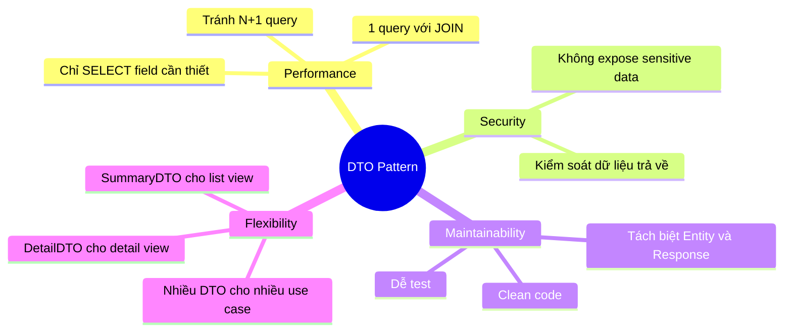
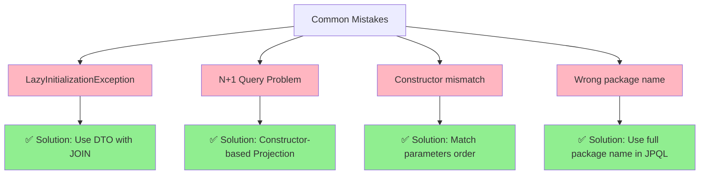
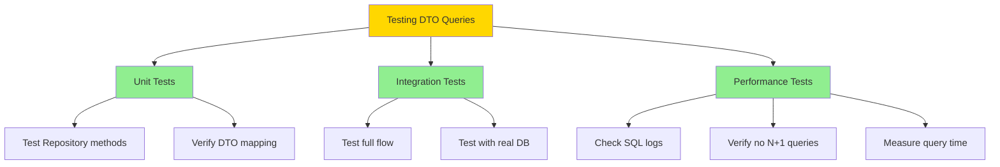

# Sơ đồ minh họa DTO Pattern

## 1. Sơ đồ quan hệ giữa các bảng

## 2. Luồng xử lý DTO

## 3. So sánh Entity vs DTO

```mermaid
graph TB
    subgraph "Cách 1: Dùng Entity (❌ Không tốt)"
        A1[Client Request] --> B1[Controller]
        B1 --> C1[Repository.findById]
        C1 --> D1[Query 1: SELECT ops_dossiers]
        D1 --> E1[OpsDossier Entity]
        E1 --> F1[getApplicant]
        F1 --> G1[Query 2: SELECT sys_users]
        G1 --> H1[getService]
        H1 --> I1[Query 3: SELECT cat_services]
        I1 --> J1[getCurrentHandler]
        J1 --> K1[Query 4: SELECT sys_users]
        K1 --> L1[getDepartment]
        L1 --> M1[Query 5: SELECT sys_departments]
        M1 --> N1[❌ 5 queries - N+1 problem]
    end
    
    subgraph "Cách 2: Dùng DTO (✅ Tốt)"
        A2[Client Request] --> B2[Controller]
        B2 --> C2[Repository.findDossierDetailById]
        C2 --> D2[Query 1: SELECT với JOIN]
        D2 --> E2[OpsDossierDetailDTO]
        E2 --> F2[✅ 1 query duy nhất]
    end
```

## 4. Constructor-based Projection Flow

## 5. Kiến trúc 3-layer

## 6. Decision Tree: Chọn phương pháp DTO

## 7. Performance Comparison

## 8. DTO Pattern Benefits

## 9. Common Pitfalls

## 10. Testing Strategy

